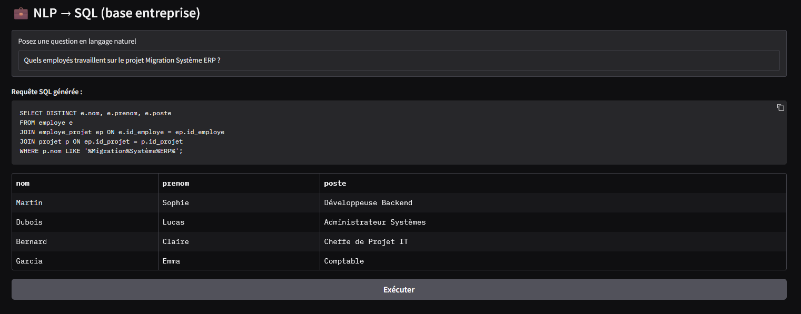

# 💼 NLP2SQL with Mistral Large 2


🇫🇷 **This project was proudly developed with Mistral AI (French technology).**

---

## 🎯 Objective
This project demonstrates how to integrate a **Mistral AI agent (Mistral Large 2)** with a corporate-style **MySQL database**, enabling natural language queries that are automatically converted into SQL and executed in real time.

Users can simply ask questions like *“Which employees are working on the Migration ERP project?”* and get results as structured tables.

---

## 🏗️ Database Structure
The `entreprise` database contains 4 main tables:

- **employe**: employee information (id, name, service, role)  
- **projet**: project information (id, name, budget, dates, status)  
- **employe_projet**: many-to-many relationship between employees and projects (role, allocation rate)  
- **tache**: tasks linked to projects (description, status, deadline, assignee)  

A **trigger** automatically updates a project status to *Completed* once all tasks are finished.  
A **stored procedure** provides statistics on project progression.

---

## ⚙️ Methodology
- Definition of a **system prompt** to guide the AI agent  
- Use of **Mistral Large 2** as the NLP2SQL engine (API `conversations`)  
- **Gradio** interface for user queries and displaying results as tables  
- Local **MySQL** database populated with realistic, corporate-style data  

---

## 📂 Repository Structure
```
NLP2SQL_project/
├── README.md                # Main documentation (French)
├── README_En.md             # English translated documentation
├── code/                    # Python scripts and prompts
│   ├── NLP2SQL.py           # Main script (Gradio + Mistral API + MySQL)
│   ├── system_prompt.txt    # System prompt for the AI agent
│   └── requete_NLP.txt      # Example natural language queries
├── database/                # MySQL database
│   └── entreprise.sql       # SQL script to recreate the database
├── screenshots/             # Visual demonstrations
│   ├── NLP_in_action_1.gif  # Demo animation 1
│   ├── NLP_in_action_2.gif  # Demo animation 2
│   └── NLP_screenshot.png   # Static screenshot
```

---

## 📸 Preview


---

## 🌍 French Version
The French version of this README is available in [README.md](README.md).
